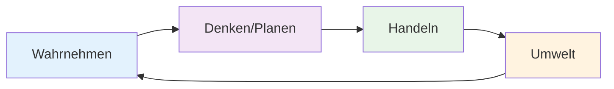

# Einführung in KI-Agenten

Willkommen zur spannendsten Entwicklung in der KI-Welt: **Agentic AI**! In dieser Lektion lernen Sie, was KI-Agenten sind und warum sie die Zukunft der Künstlichen Intelligenz darstellen.

## 🤖 Was ist ein KI-Agent?

:::tip Definition
Ein **KI-Agent** ist ein autonomes System, das:
- **Ziele** selbstständig verfolgt
- **Entscheidungen** eigenständig trifft
- Mit der **Umwelt** interagiert
- Aus **Erfahrungen** lernt
:::

### 🔄 Der Agent-Cycle



## 🆚 Traditionelle KI vs. Agentic AI

| Aspekt | Traditionelle KI | Agentic AI |
|--------|------------------|------------|
| **Interaktion** | Einmalige Eingabe → Ausgabe | Kontinuierliche Interaktion |
| **Autonomie** | Folgt festen Regeln | Selbstständige Entscheidungen |
| **Ziele** | Spezifische Aufgabe | Komplexe, langfristige Ziele |
| **Lernen** | Statisches Training | Kontinuierliches Lernen |
| **Beispiel** | Bildklassifikation | Persönlicher Assistent |

## 🏗️ Anatomie eines KI-Agenten

### Die vier Kernkomponenten:

#### 1. **Sensors (Sensoren)** 👁️
- Nehmen Informationen aus der Umwelt auf
- Beispiele: Kameras, Mikrofone, APIs, Datenbanken

#### 2. **Actuators (Aktoren)** 🦾
- Führen Aktionen in der Umwelt aus
- Beispiele: Motoren, Displays, API-Calls, E-Mails

#### 3. **Agent Function (Agent-Funktion)** 🧠
- Das "Gehirn" des Agenten
- Entscheidet basierend auf Wahrnehmungen

#### 4. **Agent Program (Agent-Programm)** 💻
- Konkrete Implementierung der Agent-Funktion
- Der Code, der den Agenten zum Leben erweckt

### 🔧 Praktisches Beispiel

```python
class SimpleAgent:
    def __init__(self, goal):
        self.goal = goal
        self.memory = []
        self.current_state = None
    
    def perceive(self, environment):
        """Sensoren: Umwelt wahrnehmen"""
        self.current_state = environment.get_state()
        return self.current_state
    
    def think(self):
        """Agent-Funktion: Entscheidung treffen"""
        if self.goal_achieved():
            return "stop"
        else:
            return self.choose_action()
    
    def act(self, action, environment):
        """Aktoren: Handlung ausführen"""
        result = environment.execute(action)
        self.memory.append((action, result))
        return result
    
    def goal_achieved(self):
        """Prüfen ob Ziel erreicht wurde"""
        return self.current_state == self.goal
```

## 🌟 Typen von KI-Agenten

### 1. **Simple Reflex Agents** 🔄
- Reagieren direkt auf Wahrnehmungen
- Keine Erinnerung an Vergangenheit
- **Beispiel**: Thermostat

```python
def simple_reflex_agent(percept):
    if percept == "too_hot":
        return "turn_on_ac"
    elif percept == "too_cold":
        return "turn_on_heater"
    else:
        return "do_nothing"
```

### 2. **Model-Based Reflex Agents** 🗺️
- Haben ein internes Modell der Welt
- Berücksichtigen vergangene Aktionen
- **Beispiel**: Navigations-App

### 3. **Goal-Based Agents** 🎯
- Verfolgen spezifische Ziele
- Planen Aktionssequenzen
- **Beispiel**: Schach-AI

### 4. **Utility-Based Agents** ⚖️
- Bewerten verschiedene Ziele nach Nutzen
- Optimieren für beste Ergebnisse
- **Beispiel**: Investitions-Bot

### 5. **Learning Agents** 🧠
- Verbessern sich durch Erfahrung
- Adaptieren ihr Verhalten
- **Beispiel**: Empfehlungssystem

## 🚀 Reale Anwendungen von KI-Agenten

### 🏠 Smart Home Assistant
```python
class SmartHomeAgent:
    def __init__(self):
        self.devices = ["lights", "thermostat", "security"]
        self.user_preferences = {}
    
    def morning_routine(self):
        actions = [
            "turn_on_lights",
            "set_temperature(22)",
            "brew_coffee",
            "read_news_summary"
        ]
        return self.execute_sequence(actions)
```

### 💼 Business Process Automation
- **Dokumentenverarbeitung** automatisieren
- **Kundenanfragen** intelligent routen
- **Datenanalyse** und Berichterstattung

### 🎮 Game AI
- **NPCs** mit realistischem Verhalten
- **Adaptive Schwierigkeit**
- **Prozedurale Inhaltsgenerierung**

## ⚡ Warum sind Agenten so mächtig?

### 1. **Autonomie** 🔓
- Arbeiten selbstständig ohne ständige Überwachung
- Können komplexe, langfristige Aufgaben übernehmen

### 2. **Adaptivität** 🔄
- Passen sich an neue Situationen an
- Lernen aus Fehlern und Erfolgen

### 3. **Skalierbarkeit** 📈
- Mehrere Agenten können zusammenarbeiten
- Bewältigen komplexe, verteilte Probleme

### 4. **Natürliche Interaktion** 💬
- Kommunizieren in natürlicher Sprache
- Verstehen Kontext und Absichten

## 🛠️ Tools und Frameworks für Agentic AI

### Beliebte Frameworks:
- **LangChain** - Framework für LLM-Agenten
- **AutoGPT** - Autonome GPT-Agenten
- **CrewAI** - Multi-Agent-Systeme
- **Semantic Kernel** - Microsoft's Agent-Framework

### Beispiel mit LangChain:
```python
from langchain.agents import initialize_agent
from langchain.llms import OpenAI
from langchain.tools import DuckDuckGoSearchRun

# Tools definieren
search = DuckDuckGoSearchRun()
tools = [search]

# Agent erstellen
llm = OpenAI(temperature=0)
agent = initialize_agent(
    tools, 
    llm, 
    agent="zero-shot-react-description",
    verbose=True
)

# Agent verwenden
result = agent.run("Was sind die neuesten KI-Trends 2025?")
```

## 🎯 Hands-on Challenge

:::info Ihre erste Agent-Aufgabe
**Erstellen Sie einen "Personal Task Agent"**, der:
1. Eine Todo-Liste verwaltet
2. Aufgaben nach Priorität sortiert
3. Erinnerungen sendet
4. Fortschritt verfolgt

**Zeit**: 30 Minuten
**Tools**: Python, einfache Klassen
:::

## 🔮 Die Zukunft von Agentic AI

### Trends für 2025:
- **Multi-Modal Agents** - Verstehen Text, Bild, Audio
- **Collaborative AI** - Teams von spezialisierten Agenten
- **Embodied AI** - Agenten in physischen Robotern
- **Ethical AI Agents** - Selbst-überwachende ethische Systeme

## 📚 Zusammenfassung

KI-Agenten repräsentieren einen Paradigmenwechsel von:
- **Passiven Tools** → **Aktiven Partnern**
- **Einmaligen Antworten** → **Kontinuierlicher Unterstützung**
- **Starren Regeln** → **Adaptivem Lernen**

## 🚀 Nächste Schritte

In der nächsten Lektion tauchen wir tiefer in **Agent-Architekturen** ein und lernen, wie man robuste, skalierbare KI-Agenten designed.

:::tip Vorbereitung
Denken Sie über Bereiche in Ihrem Leben nach, wo ein KI-Agent hilfreich wäre. Das wird Ihnen beim nächsten Hands-on Projekt helfen!
:::

---

**Bereit, Ihren ersten echten KI-Agenten zu bauen? Let's go! 🤖🚀** 