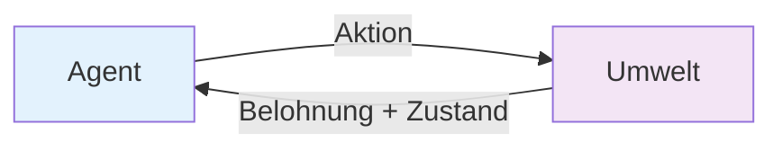

# Grundlagen des Reinforcement Learning

Willkommen zum spannenden Bereich des **Reinforcement Learning** (RL)! Hier lernen Sie, wie KI-Systeme durch Belohnung und Bestrafung lernen - genau wie wir Menschen.

## 🎯 Was ist Reinforcement Learning?

:::tip Definition
**Reinforcement Learning** ist ein Lernparadigma, bei dem ein Agent durch Interaktion mit seiner Umwelt lernt, indem er für gute Aktionen belohnt und für schlechte bestraft wird.
:::

### 🔄 Der RL-Kreislauf



## 🧩 Die Kernkomponenten

### 1. **Agent** 🤖
- Das lernende System
- Trifft Entscheidungen basierend auf dem aktuellen Zustand

### 2. **Environment (Umwelt)** 🌍
- Die Welt, in der der Agent agiert
- Reagiert auf die Aktionen des Agenten

### 3. **State (Zustand)** 📊
- Beschreibt die aktuelle Situation
- Beispiel: Position im Spiel, Marktdaten

### 4. **Action (Aktion)** ⚡
- Was der Agent tun kann
- Beispiel: Links/Rechts bewegen, Kaufen/Verkaufen

### 5. **Reward (Belohnung)** 🏆
- Feedback für die Aktion
- Positiv für gute, negativ für schlechte Aktionen

## 🎮 Praktisches Beispiel: Pac-Man

```python
class PacManRL:
    def __init__(self):
        self.position = (0, 0)
        self.score = 0
        self.game_over = False
    
    def get_state(self):
        """Aktueller Zustand des Spiels"""
        return {
            'position': self.position,
            'nearby_dots': self.count_nearby_dots(),
            'ghost_distance': self.nearest_ghost_distance()
        }
    
    def take_action(self, action):
        """Führe eine Aktion aus"""
        if action == 'up':
            self.position = (self.position[0], self.position[1] + 1)
        elif action == 'down':
            self.position = (self.position[0], self.position[1] - 1)
        # ... weitere Aktionen
        
        return self.calculate_reward()
    
    def calculate_reward(self):
        """Berechne Belohnung für die Aktion"""
        reward = 0
        if self.ate_dot():
            reward += 10  # Punkt gegessen = +10
        if self.hit_ghost():
            reward -= 100  # Geist berührt = -100
        return reward
```

## 🆚 RL vs. andere ML-Ansätze

| Aspekt | Supervised Learning | Unsupervised Learning | Reinforcement Learning |
|--------|-------------------|---------------------|---------------------|
| **Daten** | Gelabelte Beispiele | Ungelabelte Daten | Interaktion mit Umwelt |
| **Feedback** | Direkte Korrekturen | Kein Feedback | Verzögerte Belohnungen |
| **Ziel** | Vorhersage | Mustererkennung | Optimale Strategie |
| **Beispiel** | Spam-Filter | Clustering | Spiele-AI |

## 🎪 Arten von RL-Problemen

### 1. **Episodic vs. Continuing** 📺
- **Episodic**: Klar definiertes Ende (Schach-Spiel)
- **Continuing**: Läuft unendlich weiter (Aktienhandel)

### 2. **Discrete vs. Continuous** 🎚️
- **Discrete**: Begrenzte Aktionen (Hoch/Runter/Links/Rechts)
- **Continuous**: Unendliche Aktionen (Lenkwinkel beim Autofahren)

### 3. **Single vs. Multi-Agent** 👥
- **Single**: Ein Agent lernt allein
- **Multi**: Mehrere Agenten interagieren

## ⚖️ Exploration vs. Exploitation

:::info Das RL-Dilemma
Sollte der Agent:
- **Explorieren** 🔍 - Neue Aktionen ausprobieren
- **Exploitieren** 💰 - Bekannte gute Aktionen wiederholen
:::

### Epsilon-Greedy Strategie:
```python
import random

def epsilon_greedy_action(q_values, epsilon=0.1):
    if random.random() < epsilon:
        # Exploration: Zufällige Aktion
        return random.choice(range(len(q_values)))
    else:
        # Exploitation: Beste bekannte Aktion
        return q_values.index(max(q_values))
```

## 🧠 Wichtige RL-Algorithmen (Überblick)

### 1. **Q-Learning** 📈
- Lernt Werte für Zustand-Aktion-Paare
- Model-free Algorithmus

### 2. **SARSA** 🔄
- State-Action-Reward-State-Action
- On-policy Learning

### 3. **Deep Q-Networks (DQN)** 🕸️
- Q-Learning mit neuronalen Netzen
- Kann komplexe Zustände verarbeiten

### 4. **Policy Gradients** 📊
- Lernt direkt eine Politik
- Gut für kontinuierliche Aktionen

## 🎮 Reale Anwendungen

### 🎯 Game AI
- **AlphaGo**: Weltmeister im Go besiegt
- **OpenAI Five**: Dota 2 Champions
- **AlphaStar**: StarCraft II Profi-Level

### 🚗 Autonome Fahrzeuge
- Parkplatz finden
- Spurwechsel optimieren
- Verkehrsfluss verbessern

### 💰 Finanzen
- Algorithmic Trading
- Portfolio-Optimierung
- Risikomanagement

### 🏭 Industrie 4.0
- Roboter-Navigation
- Qualitätskontrolle
- Produktionsplanung

## 📊 RL in Zahlen

:::info Marktdaten
- **97%** der Hedge Funds nutzen RL für Trading
- **$2.8 Billionen** verwaltet von KI-Algorithmen
- **85%** weniger Energieverbrauch durch RL-optimierte Rechenzentren
:::

## 🎯 Hands-on Challenge

:::tip Ihre erste RL-Aufgabe
**Erstellen Sie einen einfachen "Coin Collecting Agent"**:
1. Agent bewegt sich in einem Gitter
2. Sammelt Münzen (+10 Punkte)
3. Vermeidet Hindernisse (-5 Punkte)
4. Implementieren Sie Epsilon-Greedy Exploration

**Zeit**: 45 Minuten
**Tools**: Python, NumPy
:::

## 🔬 RL-Forschung 2025

### Neue Trends:
- **Meta-Learning**: Lernen zu lernen
- **Multi-Task RL**: Ein Agent, viele Aufgaben
- **Safe RL**: Sicherheit während des Lernens
- **Human-in-the-Loop**: Menschen als Trainer

## 📚 Mathematische Grundlagen (Sneak Peek)

### Bellman-Gleichung:
```
V(s) = max_a Σ P(s'|s,a) [R(s,a,s') + γ V(s')]
```

**Keine Sorge!** Das sieht komplizierter aus, als es ist. In der nächsten Lektion erklären wir die Mathematik Schritt für Schritt.

## 🚀 Nächste Schritte

In der nächsten Lektion tauchen wir tief in **Markov Decision Processes** ein - das mathematische Fundament von RL.

:::tip Vorbereitung
Denken Sie an Situationen in Ihrem Leben, wo Sie durch Trial-and-Error gelernt haben. Das ist genau das, was RL formalisiert!
:::

---

**Bereit, Ihren ersten RL-Agenten zu programmieren? Let's dive in! 🎮🚀** 