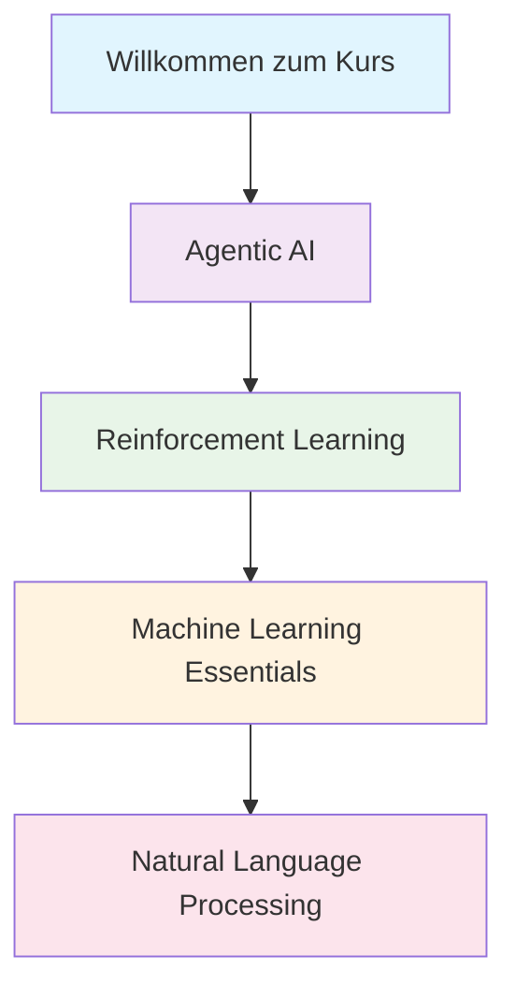

# Kurs-Aufbau und Lernpfad

Unser AI A-Z 2025 Kurs ist sorgfältig strukturiert, um Sie von den Grundlagen bis zur Expertise zu führen. Hier erfahren Sie, wie der Kurs aufgebaut ist und was Sie erwartet.

## 📚 Kursstruktur

### 🏗️ Modularer Aufbau

Der Kurs ist in **4 Hauptmodule** unterteilt, die aufeinander aufbauen:

## 🎯 Modul 1: Agentic AI (2-3 Wochen)

### 📖 Was Sie lernen:
- **Grundlagen autonomer KI-Agenten**
- **Agent-Architekturen und Design-Patterns**
- **Multi-Agent-Systeme**
- **Praktische Implementierung**

### 📋 Lektionen:
1. **Einführung in Agents** - Was sind KI-Agenten?
2. **Agent-Architekturen** - Reactive, Deliberative, Hybrid
3. **Praktische Anwendungen** - Real-world Use Cases
4. **Hands-on Projekt** - Ihren ersten AI-Agent bauen

### 🛠️ Praktische Projekte:
- **Chatbot-Agent** mit Langchain
- **Task-Automation Agent** für Dateiverwaltung
- **Multi-Agent System** für Teamarbeit

:::tip Warum Agentic AI zuerst?
Agentic AI ist die Zukunft der KI! Wir starten damit, weil es das modernste und praktischste Thema ist.
:::

## 🧠 Modul 2: Reinforcement Learning (2-3 Wochen)

### 📖 Was Sie lernen:
- **Grundlagen des verstärkenden Lernens**
- **Markov Decision Processes (MDPs)**
- **Q-Learning und Policy Gradients**
- **Deep Reinforcement Learning**

### 📋 Lektionen:
1. **RL Grundlagen** - Wie lernt KI durch Belohnung?
2. **Markov Decision Processes** - Mathematische Grundlagen
3. **Q-Learning** - Der klassische RL-Algorithmus
4. **Deep Q-Networks** - Neuronale Netze treffen RL
5. **Policy Gradients** - Fortgeschrittene RL-Methoden

### 🛠️ Praktische Projekte:
- **Pac-Man AI** mit Q-Learning
- **Trading Bot** mit Deep RL
- **Game AI** für einfache Spiele

## 🤖 Modul 3: Machine Learning Essentials (2-3 Wochen)

### 📖 Was Sie lernen:
- **Supervised und Unsupervised Learning**
- **Neural Networks von Grund auf**
- **Deep Learning Architekturen**
- **Best Practices für ML-Projekte**

### 📋 Lektionen:
1. **Supervised Learning** - Klassifikation und Regression
2. **Unsupervised Learning** - Clustering und Dimensionsreduktion
3. **Neural Networks** - Die Grundlagen verstehen
4. **Deep Learning** - Convolutional und Recurrent Networks

### 🛠️ Praktische Projekte:
- **Bildklassifikation** mit CNNs
- **Sentiment Analyse** mit RNNs
- **Empfehlungssystem** für E-Commerce

## 💬 Modul 4: Natural Language Processing (2-3 Wochen)

### 📖 Was Sie lernen:
- **Text Preprocessing und Feature Engineering**
- **Word Embeddings und Transformers**
- **Large Language Models (LLMs)**
- **Praktische NLP-Anwendungen**

### 📋 Lektionen:
1. **Text Preprocessing** - Daten für NLP vorbereiten
2. **Word Embeddings** - Wörter als Vektoren
3. **Transformers** - Die Revolution im NLP
4. **Large Language Models** - GPT, BERT und Co.

### 🛠️ Praktische Projekte:
- **Text Summarization Tool**
- **Question-Answering System**
- **Custom Chatbot** mit LLMs

## 📊 Lernfortschritt und Bewertung

### 🎯 Wie wird Ihr Fortschritt gemessen?

| Element | Gewichtung | Beschreibung |
|---------|------------|--------------|
| 📝 Quizzes | 30% | Multiple-Choice und praktische Fragen |
| 🛠️ Projekte | 50% | Hands-on Implementierungen |
| 🎓 Abschlussprojekt | 20% | Umfassendes KI-System |

### 📈 Fortschrittsstufen

1. **Beginner** (0-25%) - Grundlagen verstanden
2. **Intermediate** (26-60%) - Praktische Anwendung
3. **Advanced** (61-85%) - Selbstständige Entwicklung
4. **Expert** (86-100%) - Innovationsfähigkeit

## ⏰ Zeitplanung und Flexibilität

### 📅 Empfohlener Zeitplan

| Woche | Modul | Fokus | Zeitaufwand |
|-------|-------|--------|-------------|
| 1-2 | Willkommen & Agentic AI | Grundlagen, erste Projekte | 6-8h/Woche |
| 3-5 | Reinforcement Learning | Mathematik, Algorithmen | 7-9h/Woche |
| 6-8 | Machine Learning | Praktische Anwendungen | 6-8h/Woche |
| 9-11 | Natural Language Processing | Sprachmodelle, LLMs | 7-9h/Woche |
| 12 | Abschlussprojekt | Integration aller Themen | 10-12h |

### 🔄 Flexibles Lernen

:::info Ihr Tempo
Sie können den Kurs in Ihrem eigenen Tempo absolvieren! Einige schaffen es in 8 Wochen, andere brauchen 16 Wochen - beides ist völlig in Ordnung.
:::

## 🛠️ Technische Voraussetzungen

### 💻 Software & Tools

- **Python 3.8+** (kostenlos)
- **Jupyter Notebooks** (über Google Colab möglich)
- **Git** für Versionskontrolle
- **VS Code** oder ähnliche IDE

### ☁️ Cloud-Optionen

Keine teure Hardware erforderlich! Wir nutzen:
- **Google Colab** (kostenlos mit GPU)
- **Kaggle Notebooks** (kostenlos)
- **GitHub Codespaces** (optional)

## 🎓 Zertifizierung

### 📜 Was Sie erhalten:

1. **Modulzertifikate** - Nach jedem abgeschlossenen Modul
2. **Projektzertifikate** - Für erfolgreich abgeschlossene Projekte  
3. **Gesamtzertifikat** - "AI A-Z 2025 Certified Expert"

### ✅ Zertifizierungsvoraussetzungen:

- ✅ Alle Module abgeschlossen (80%+ Score)
- ✅ Mindestens 3 Projekte erfolgreich eingereicht
- ✅ Abschlussprojekt präsentiert

## 🤝 Community und Support

### 💬 Lerngemeinschaft

- **Discord-Server** für direkten Austausch
- **Wöchentliche Live-Sessions** mit Experten
- **Peer-Review** für Projekte
- **Mentoring-Programme**

### 🆘 Wenn Sie Hilfe brauchen:

1. **Dokumentation** durchsuchen
2. **Community-Forum** fragen
3. **Office Hours** nutzen (wöchentlich)
4. **1-on-1 Mentoring** buchen

## 🚀 Bereit für Ihren ersten AI-Agent?

Jetzt, da Sie den Kursaufbau verstehen, ist es Zeit für den ersten praktischen Schritt! Klicken Sie auf **"Agentic AI > Einführung Agents"**, um Ihre Reise zu beginnen.

:::tip Pro-Tipp
Bookmarken Sie diese Seite! Sie können jederzeit hierher zurückkehren, um Ihren Fortschritt zu überprüfen.
:::

---

**Lassen Sie uns mit dem spannendsten Teil beginnen - Agentic AI! 🤖🚀** 