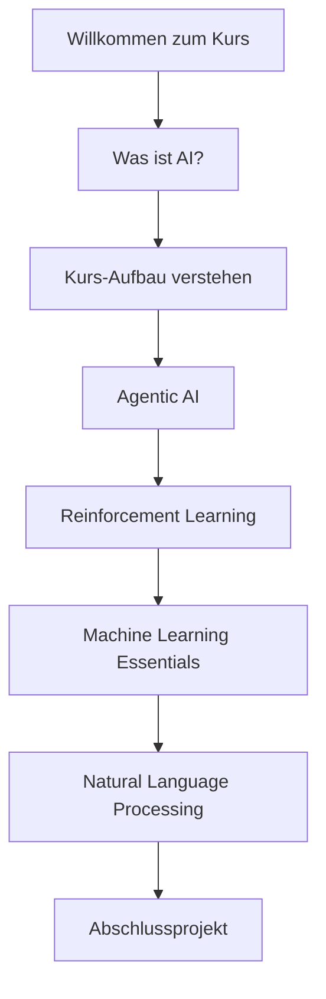

# Artificial Intelligence A-Z 2025 - Kurs-Übersicht

Willkommen zum umfassendsten KI-Kurs für 2025! Dieser Kurs führt Sie von den absoluten Grundlagen bis hin zu den neuesten Technologien der Künstlichen Intelligenz.

## 🎯 Was Sie in diesem Kurs lernen werden

### 1. **Agentic AI** - Die Zukunft der KI
- Autonome KI-Agenten verstehen und entwickeln
- Agent-Architekturen und Design-Patterns
- Multi-Agent-Systeme und Kommunikation
- Praktische Implementierung mit modernen Frameworks

### 2. **Reinforcement Learning** - KI lernt durch Erfahrung
- Grundlagen des verstärkenden Lernens
- Markov Decision Processes (MDPs)
- Q-Learning und Policy Gradients
- Deep Reinforcement Learning mit TensorFlow

### 3. **Machine Learning Essentials** - Das Fundament
- Supervised und Unsupervised Learning
- Neural Networks von Grund auf verstehen
- Deep Learning Architectures
- Best Practices für ML-Projekte

### 4. **Natural Language Processing** - KI versteht Sprache
- Text Preprocessing und Feature Engineering
- Word Embeddings und Transformers
- Large Language Models (LLMs)
- Praktische NLP-Anwendungen

## 🚀 Kurs-Features

:::tip Modern & Aktuell
Alle Inhalte sind auf dem neuesten Stand von 2025 und enthalten die aktuellsten KI-Entwicklungen!
:::

- **📱 Mobile-optimiert**: Lernen Sie überall und jederzeit
- **🛠️ Praxisorientiert**: Echte Projekte, echte Lösungen
- **🎮 Interaktiv**: Quizzes, Coding-Übungen und Hands-on Labs
- **🏆 Zertifikat**: Offizieller Abschluss nach erfolgreichem Absolvieren

## 📊 Ihr Lernpfad

## ⏱️ Zeitaufwand

- **Gesamtdauer**: 8-12 Wochen (je nach Tempo)
- **Wöchentlicher Aufwand**: 5-8 Stunden
- **Praktische Projekte**: 4 größere Projekte
- **Mini-Projekte**: 15+ kleinere Übungen

## 🎓 Voraussetzungen

### Empfohlen:
- Grundlegende Programmierkenntnisse (Python bevorzugt)
- Mathematische Grundlagen (Lineare Algebra, Statistik)
- Interesse an KI und maschinellem Lernen

### Nicht erforderlich:
- Vorerfahrung mit KI/ML
- Spezielle Software-Kenntnisse
- Teure Hardware (Cloud-Lösungen verfügbar)

## 💡 Was macht diesen Kurs besonders?

:::info 2025 Edition
Dieser Kurs wurde speziell für 2025 entwickelt und enthält die neuesten KI-Trends wie:
- **Agentic AI** und autonome Systeme
- **Multimodale LLMs** 
- **KI-Ethik** und verantwortungsvolle AI
- **Edge AI** für mobile Geräte
:::

## 🚀 Bereit zu starten?

Klicken Sie auf **"Was ist AI?"** in der Seitenleiste, um mit Ihrer AI-Reise zu beginnen!

---

**Lassen Sie uns die Zukunft der KI gemeinsam erkunden! 🤖✨** 