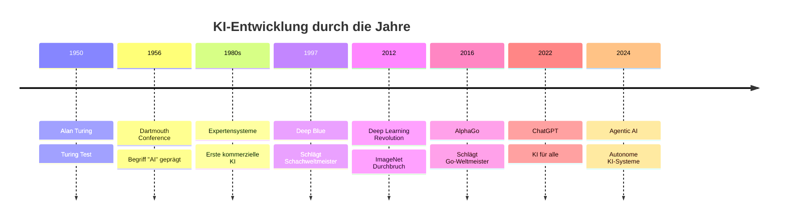

# Was ist Künstliche Intelligenz?

Künstliche Intelligenz (KI oder AI) ist eines der transformativsten Technologiefelder unserer Zeit. Doch was genau verbirgt sich hinter diesem Begriff?

## 🧠 Definition von KI

:::tip Einfache Definition
**Künstliche Intelligenz** ist die Fähigkeit von Maschinen, Aufgaben auszuführen, die normalerweise menschliche Intelligenz erfordern - wie Lernen, Problemlösung, Mustererkennung und Entscheidungsfindung.
:::

### Erweiterte Definition

KI ist ein Teilgebiet der Informatik, das sich darauf konzentriert, intelligente Maschinen zu schaffen, die wie Menschen denken und handeln können. Es umfasst:

- **Maschinelles Lernen** - Systeme, die aus Daten lernen
- **Deep Learning** - Neuronale Netze mit vielen Schichten
- **Natural Language Processing** - Verstehen und Generieren menschlicher Sprache
- **Computer Vision** - Verstehen und Interpretieren visueller Informationen
- **Robotik** - Intelligente physische Systeme

## 📈 Die Evolution der KI

### Zeitstrahl der KI-Entwicklung



## 🔍 Arten von KI

### 1. **Narrow AI (Schwache KI)** 
- Spezialisiert auf spezifische Aufgaben
- Beispiele: Spracherkennung, Bildklassifikation, Schach
- **Status**: Heute weit verbreitet

### 2. **General AI (Starke KI)**
- Kann jede intellektuelle Aufgabe wie ein Mensch ausführen
- Kann zwischen verschiedenen Domänen transferieren
- **Status**: Noch nicht erreicht (Forschungsziel)

### 3. **Super AI**
- Übertrifft menschliche Intelligenz in allen Bereichen
- Hypothetische zukünftige Entwicklung
- **Status**: Theoretisch/Spekulativ

## 🛠️ Wie funktioniert KI?

### Machine Learning Grundlagen

```python
# Vereinfachtes Beispiel eines ML-Algorithmus
def learn_from_data(data, labels):
    # 1. Daten aufbereiten
    processed_data = preprocess(data)
    
    # 2. Modell trainieren
    model = train_model(processed_data, labels)
    
    # 3. Vorhersagen treffen
    predictions = model.predict(new_data)
    
    return predictions
```

### Die drei Säulen der modernen KI

1. **Daten** 📊
   - Große Mengen an Trainingsdaten
   - Qualität wichtiger als Quantität
   - Vielfältige und repräsentative Datensätze

2. **Algorithmen** 🧮
   - Neuronale Netze und Deep Learning
   - Transformer-Architekturen
   - Reinforcement Learning

3. **Rechenleistung** 💻
   - GPUs und spezialisierte KI-Chips
   - Cloud Computing
   - Parallele Verarbeitung

## 🌍 KI in der Praxis - Beispiele aus dem Alltag

### Täglich genutzte KI-Anwendungen

| Bereich | Anwendung | KI-Technologie |
|---------|-----------|----------------|
| 📱 Smartphone | Siri, Google Assistant | Natural Language Processing |
| 🚗 Transport | Autonome Fahrzeuge | Computer Vision, Sensorfusion |
| 🛒 E-Commerce | Produktempfehlungen | Collaborative Filtering |
| 🎵 Streaming | Musik-/Filmempfehlungen | Recommender Systems |
| 📧 Email | Spam-Filter | Text Classification |
| 📷 Fotos | Gesichtserkennung | Computer Vision |

## 🎯 Warum ist KI so wichtig?

### Transformation von Industrien

:::info Wirtschaftlicher Einfluss
KI wird bis 2030 voraussichtlich **15,7 Billionen Dollar** zur globalen Wirtschaft beitragen - das entspricht dem BIP von China und Indien zusammen!
:::

### Bereiche der Transformation

1. **Gesundheitswesen** 🏥
   - Früherkennung von Krankheiten
   - Personalisierte Medizin
   - Beschleunigte Medikamentenentwicklung

2. **Bildung** 🎓
   - Personalisierte Lernpfade
   - Intelligente Tutoring-Systeme
   - Automatisierte Bewertung

3. **Umwelt** 🌱
   - Klimamodellierung
   - Optimierung erneuerbarer Energien
   - Smart Cities

## ⚡ Die neuesten KI-Trends 2025

### 1. **Agentic AI** - Autonome KI-Agenten
- KI-Systeme, die selbstständig Ziele verfolgen
- Multi-Agent-Kooperation
- Erweiterte Planungsfähigkeiten

### 2. **Multimodale KI**
- Versteht Text, Bild, Audio und Video gleichzeitig
- Beispiel: GPT-4 Vision, DALL-E 3

### 3. **Edge AI**
- KI direkt auf Geräten (ohne Cloud)
- Niedrigere Latenz, besserer Datenschutz

## 🤔 Herausforderungen und Ethik

### Wichtige Überlegungen

- **Bias und Fairness** - Vermeidung von Diskriminierung
- **Transparenz** - Nachvollziehbare KI-Entscheidungen
- **Datenschutz** - Schutz persönlicher Informationen
- **Arbeitsplätze** - Auswirkungen auf den Arbeitsmarkt
- **Sicherheit** - Schutz vor Missbrauch

:::warning Verantwortungsvolle KI
Bei aller Begeisterung für KI müssen wir sicherstellen, dass sie zum Wohl der Menschheit eingesetzt wird!
:::

## 🚀 Ihr nächster Schritt

Jetzt, da Sie verstehen, was KI ist, lassen Sie uns erkunden, wie dieser Kurs aufgebaut ist und was Sie als nächstes erwartet!

---

**Bereit, tiefer in die Welt der KI einzutauchen? 🤖** 