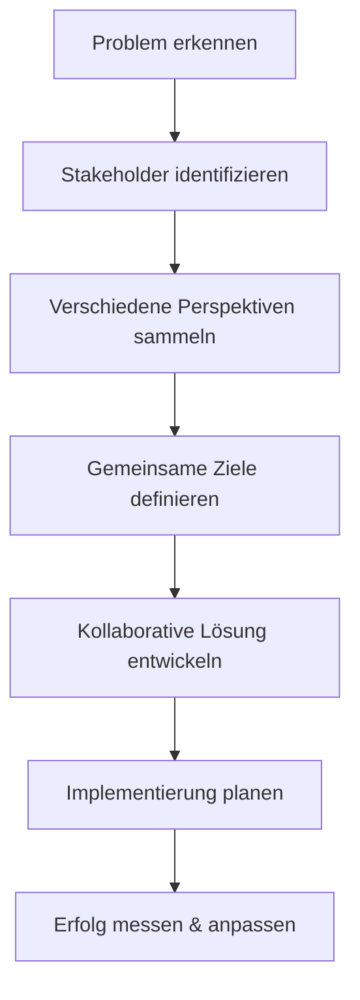

# 🤝 Lektion 3: Vertiefung und Teamarbeit

In dieser Lektion erweitern wir unsere Fähigkeiten und lernen, wie Zusammenarbeit unsere Ergebnisse verbessern kann.

## 🎯 Lernziele

Nach dieser Lektion werden Sie:
- ✅ Komplexere Probleme systematisch angehen können
- ✅ Kollaborative Lösungsansätze verstehen
- ✅ Verschiedene Perspektiven in Lösungen integrieren
- ✅ Bereit für das Kapitel-Quiz sein

## 🔄 Aufbau auf Vorherigem

Wir nutzen die Grundlagen aus den ersten beiden Lektionen:

| Lektion 1 | Lektion 2 | Lektion 3 |
|-----------|-----------|-----------|
| Grundkonzepte | Praktische Anwendung | **Vertiefung & Teamarbeit** |
| Definition, Anwendung, Verknüpfung | 5-Schritte-Methodik | Kollaboration & Komplexität |

## 🧩 Komplexe Problemlösung

### Was macht Probleme komplex?

:::info Komplexität verstehen
Komplexe Probleme haben mehrere Variablen, unklare Ursachen und verschiedene mögliche Lösungswege.
:::

#### Merkmale komplexer Probleme:
1. **Mehrere Stakeholder** mit unterschiedlichen Interessen
2. **Unvorhersagbare Faktoren** und Abhängigkeiten
3. **Verschiedene Lösungsansätze** mit Vor- und Nachteilen
4. **Zeitdruck** und Ressourcenbeschränkungen

### Erweiterte Problemlösungsstrategie

## 👥 Kollaborative Ansätze

### Warum Teamarbeit?

Verschiedene Menschen bringen unterschiedliche:
- **Erfahrungen** und Expertisen
- **Perspektiven** und Denkweisen
- **Ressourcen** und Netzwerke
- **Kreativität** und Ideen

### Erfolgreiche Teamarbeit

#### 1. Diverse Teams bilden
- Verschiedene Hintergründe und Fähigkeiten
- Komplementäre Stärken
- Offene Kommunikation

#### 2. Strukturierte Zusammenarbeit
- Klare Rollen und Verantwortlichkeiten
- Regelmäßige Abstimmung
- Gemeinsame Ziele

#### 3. Effektive Kommunikation
- Aktives Zuhören
- Konstruktives Feedback
- Transparenz

:::tip Teamarbeit-Tipp
Die beste Idee entsteht oft durch die Kombination verschiedener guter Ideen!
:::

## 🏗️ Praxisprojekt: Komplexes Szenario

### Aufgabe: Verbesserung der Lernplattform

**Situation**: Diese Lernplattform soll verbessert werden, um noch effektiver zu sein.

**Ihre Aufgabe**: Entwickeln Sie Verbesserungsvorschläge

#### Schritt 1: Stakeholder-Analyse
Wer ist beteiligt?
- **Lernende**: Wollen effektiv und angenehm lernen
- **Lehrende**: Wollen Wissen effektiv vermitteln
- **Entwickler**: Wollen technisch saubere Lösungen
- **Organisation**: Will Kosten-Nutzen-Optimierung

#### Schritt 2: Perspektiven sammeln
| Stakeholder | Bedürfnisse | Herausforderungen |
|-------------|-------------|-------------------|
| Lernende | Flexibilität, Interaktivität | Zeitmangel, unterschiedliche Lerntypen |
| Lehrende | Einfache Inhaltserstellung | Technische Komplexität |
| Entwickler | Sauberer Code, Skalierbarkeit | Wechselnde Anforderungen |
| Organisation | ROI, Benutzerfreundlichkeit | Budget- und Zeitbeschränkungen |

#### Schritt 3: Lösungen entwickeln

**Brainstorming** (5 Minuten - sammeln Sie Ideen):
- Welche Features würden helfen?
- Welche Prozesse könnten verbessert werden?
- Welche Technologien könnten eingesetzt werden?

**Bewertung** nach Kriterien:
- Nutzen für Lernende
- Implementierungsaufwand
- Kosten
- Zeitrahmen

## 🔬 Reflexion und Analyse

### Selbstreflexion
1. **Wie haben Sie das komplexe Problem angegangen?**
2. **Welche verschiedenen Perspektiven haben Sie berücksichtigt?**
3. **Was würden Sie beim nächsten Mal anders machen?**

### Lernerfolg messen
:::note Checkpoint
- ✅ Können Sie komplexe Probleme in Teilprobleme aufteilen?
- ✅ Berücksichtigen Sie verschiedene Stakeholder-Interessen?
- ✅ Entwickeln Sie kollaborative Lösungsansätze?
:::

## 🎯 Anwendung im Alltag

### Beispiele für kollaborative Problemlösung:
- **Familienprojekte**: Urlaubsplanung mit verschiedenen Wünschen
- **Arbeitskontext**: Teamprojekte mit unterschiedlichen Abteilungen
- **Gemeinde**: Nachbarschaftsinitiativen
- **Online-Communities**: Open-Source-Projekte

## 🔍 Zusammenfassung

In dieser Lektion haben Sie gelernt:

- **Komplexe Probleme** systematisch anzugehen
- **Kollaborative Ansätze** zu nutzen
- **Verschiedene Perspektiven** zu berücksichtigen
- **Strukturierte Teamarbeit** umzusetzen

## 🏆 Kapitel 1 - Abschluss

Herzlichen Glückwunsch! Sie haben das erste Kapitel erfolgreich abgeschlossen:

- ✅ **Lektion 1**: Grundlagen verstanden
- ✅ **Lektion 2**: Praktische Anwendung gelernt  
- ✅ **Lektion 3**: Vertiefung und Teamarbeit gemeistert

## ➡️ Nächste Schritte

Bevor Sie zu Kapitel 2 weitergehen:

1. **Quiz absolvieren**: Testen Sie Ihr Wissen
2. **Reflexion**: Denken Sie über das Gelernte nach
3. **Anwendung planen**: Wo können Sie die Methoden einsetzen?

:::success Kapitel abgeschlossen!
Sie sind bereit für das Quiz! Viel Erfolg! 🎉
:::

---

**[⬅️ Zurück zu Lektion 2](./lektion-2) | [➡️ Zum Quiz](./quiz-1)** 